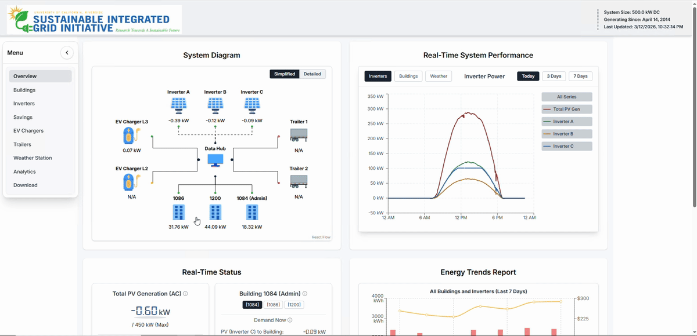

# SIGI Energy Dashboard

SIGI Energy Dashboard is a full-stack real-time energy monitoring and analytics application developed for CE-CERT at UCR facilities. It integrates telemetry from building meters, solar inverters, and weather stations to provide live system visibility, historical analysis, and operational insights through an interactive web dashboard.

The platform supports real-time monitoring of power and energy data, short-term trend visualization, utility savings analysis, and event-based notification logic for disconnected or stale data streams.

## Demo

[Watch the full demo video on YouTube](https://youtu.be/q_jhWtNiBvg)

## Overview

The dashboard combines multiple data sources and software layers into a unified energy analytics platform:

- **Field devices and telemetry sources**
  - 3 solar inverters
  - 3 building meters
  - 2 weather stations
  - Shark meter telemetry collected through **Modbus**

- **Frontend**
  - Built with **TypeScript**, **React**, **Vite**, and **Tailwind CSS**
  - Uses **WebSocket** connections for real-time updates
  - Retrieves analytics and reporting data from backend APIs

- **Backend**
  - Built with **Python** and **Flask**
  - Uses **Jinja** for server-side templating where needed
  - Exposes APIs for time-series queries, analytics, and dashboard data
  - Includes notification logic for disconnect and data restoration events

- **Database and data pipeline**
  - Telemetry is collected from field devices and processed into application-ready datasets
  - Real-time power demand data is updated at short polling intervals
  - Energy data is aggregated for historical and reporting views
  - Processed data is stored in **MySQL**
  - CSV files are generated for recordkeeping and export workflows

- **Deployment**
  - Hosted on **IIS**

## Features

- Real-time monitoring of:
  - power generation
  - net load
  - energy generation
  - net energy across PV systems and facilities

- WebSocket-based live data updates for dashboard visualization

- Interactive time-series plotting for selected:
  - inverters
  - buildings
  - weather stations

- Historical data visualization for periods of up to 7 days

- Building-level energy analytics through dashboard summary cards

- Energy trend reporting and short-term analysis graphs

- Savings analysis logic for estimating the effect of solar generation on utility bills

- Notification and alarm logic for stale, disconnected, and restored telemetry streams

## Architecture

The application is composed of the following layers:

1. **Telemetry ingestion**
   - Modbus-based collection from Shark meters and connected field devices

2. **Data processing and persistence**
   - Polling, transformation, and storage of telemetry data in MySQL
   - Export support through CSV generation

3. **Backend services**
   - Flask-based APIs for dashboard queries, analytics, and notifications
   - WebSocket support for real-time frontend updates

4. **Frontend application**
   - React and TypeScript interface for visualization, reporting, and monitoring
   - Tailwind-based responsive UI

5. **Deployment**
   - Application hosted through IIS

## Tech Stack

- **Frontend:** TypeScript, React, Vite, Tailwind CSS
- **Backend:** Python, Flask, Jinja
- **Real-time communication:** WebSocket
- **Device communication:** Modbus
- **Database:** MySQL
- **Deployment:** IIS

## Notes

This public repository is a showcase version of the project. Sensitive deployment configuration, credentials, and environment-specific infrastructure details have been omitted.
